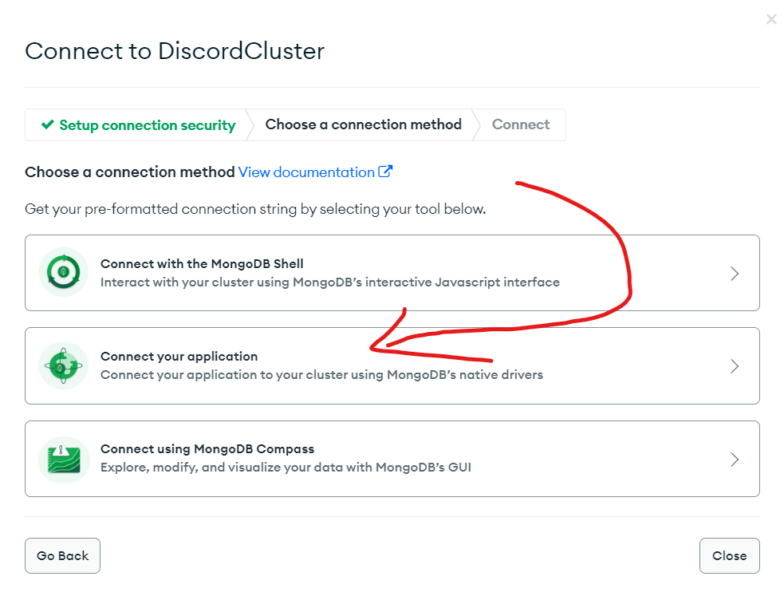
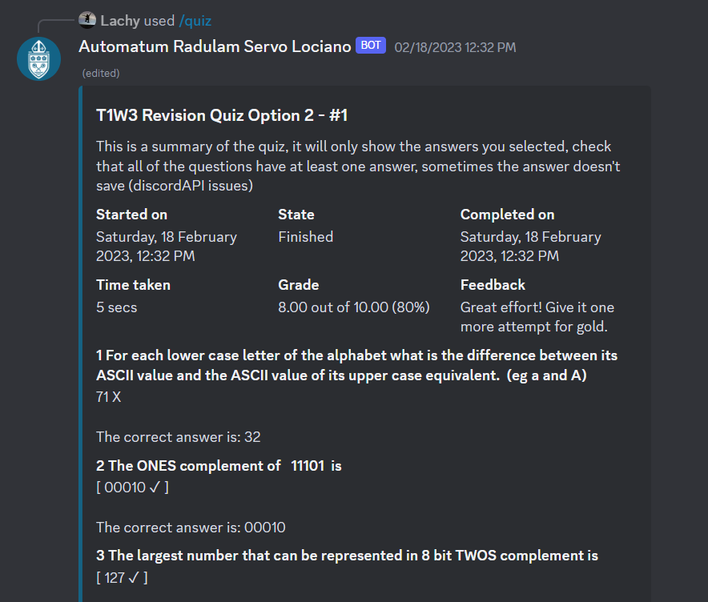

# Moodle Discord Buddy - Moodle Webscraper That Bypasses Moodle Webservices Being Disabled!
A very handy discord bot for people who use moodle for their school and have a discord group! It can display leaderboards, get assignments, get peoples profiles, send messages and the coolest of all, do the quizzes for you!
## Set up
1. First thing you need to do is rename example.env to just ".env"
2. Replace the values with your own data, like the bot token, mongo uri, and your moodle login stuff.
3. Check that headless is set to true (for the browser inside functions.js) (that way you can run the bot without a gui)

### Env Variable info
#### Discord Token   
First, set up your own instance of a discord bot. You need to visit the [discord developer portal](https://discord.com/developers/applications). After creating the bot, put that token in the example.env
#### Moodlename and password
These are so that puppeteer can login to the browser and access the course info, if a user of the bot wants to send messages or do quizzes they must login themselves with the /login command.
#### MongoDB

Visit [mongodb.com](https://www.mongodb.com/) and create an account and then set up a free cluster. The website should guide you through all the steps. 
1. After the Cluster is created click on the connect button on the database screen (as shown)

2. After clicking on that, choose the connect your application option.

3. Then finally, copy the link from the code box (replace the \<password> with your password for the cluster) and paste that into the env file.

<!-- >You may need to change other variables as well -->
---
## Usage
The prefix commands have now been deleted in favor for slash commands which are more suited for discords environment. To get a list of all commands use /help, and to get more info on a specific command use /help \<commandName>

>/login first before using commands like message, quiz, etc and logout with /logout

For the quizzes, the autofill will try fetch the correct answers from the database, if they aren't located, it will just give random answers. If the quiz has answers in the database, it should also light the buttons up green or red depending on whether or not you got the answer correct.

Here are a few examples

